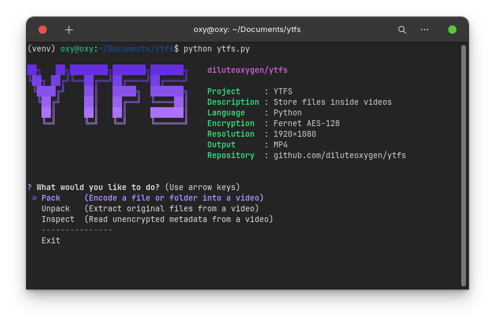

<p align="center">
  
</p>

<h1 align="center">Youtube File System</h1>

<p align="center">
  
</p>

You know the drill. Paying monthly for an S3 bucket or Google Drive to hold cold-storage archives you look at once a decade. The cloud is just someone else's computer. YouTube is also someone else's computer, but they let you upload 1080p videos for free.

`ytfs` securely packs your files or folders into colored static, allowing you to use video hosting platforms as an infinite, free hard drive.

## Before / after

You want to back up a 50MB folder. The industry standard: configure Terraform, set up an AWS S3 bucket, provision IAM user roles, install the AWS CLI, write a sync script, and attach a credit card.

With `ytfs`:

```bash
# Just pack the directory directly!
ytfs pack /path/to/my_folder
```

## Demo

<p align="center">
  
</p>

## Features & Upgrades

* **Interactive Terminal UI:** Run `ytfs` without arguments to launch a guided, beautiful wizard interface powered by `questionary` and `rich`.
* **Folder Packing Support:** Pass a directory path, and `ytfs` automatically archives and compresses it on the fly.
* **Metadata & Verification:** Each video contains secure headers containing the original filename, file type, timestamp, and size. You can `inspect` or `verify` files without fully decrypting.
* **Robust Encoding (8x8 Macro-Blocks):** Data is grouped into 8x8 pixel blocks. Even if YouTube blurs the edges, the center of the block remains perfectly readable.
* **Binary RGB:** Instead of black and white (1 bit), we use pure Red, Green, and Blue channels, securely packing 3 bits per macro-block.
* **Built-in AES-128:** Your data is encrypted *before* it becomes a video using PBKDF2 (480,000 iterations) + AES. If a bit flips, you'll know. If someone downloads your video, they just see noise.
* **Performance Benchmarks:** Run a speed test with the new `benchmark` command to check packing and unpacking performance on your system.

## How it works

Before writing pixels, the engine stops at the core requirements:

```text
1. Generate random 16-byte salt.
2. Prompt for password -> derive AES key.
3. Encrypt file -> calculate exact padding.
4. Pack bytes -> 8x8 RGB chunks.
5. Spit out MP4.
```

When downloading, it reverses the process, reads the embedded salt, asks for your password, and drops your original files/folders right back on your drive.

## Install

Make sure you have `ffmpeg` installed on your system.

```bash
git clone https://github.com/diluteoxygen/ytfs.git
cd ytfs
pip install -e .
```

## Commands

Running `ytfs` without arguments opens the interactive menu. You can also run commands directly:

| Command | Arguments | What it does |
| --- | --- | --- |
| `pack` | `<path>` | Encrypts and encodes a file or folder to `Output/Packed/<name>.mp4`. |
| `unpack` | `<video.mp4>` | Decrypts and unpacks the video back to `Output/Unpacked/<name>`. |
| `inspect` | `<video.mp4>` | View video metadata (original name, size, compressed state, payload size). |
| `verify` | `<video.mp4>` | Verify password correctness and data integrity without extracting. |
| `benchmark`| `<file>` | Run a local speed test of the encoding and decoding pipeline. |

*Note: To download your video back from YouTube without the platform handing you a corrupted mobile format, use `yt-dlp`:*

```bash
yt-dlp -f "bestvideo[height=1080][ext=mp4]" <URL>
```

## FAQ

### Will YouTube ban me for doing this?

If they figure it out, maybe. But your payload is AES-encrypted. To Google's content ID algorithms, it just looks like 10 minutes of colorful TV static. Don't upload terabytes a day and you'll be fine.

### Why is there no React web frontend?

Because you don't need one. A web app requires bypassing CORS restrictions, decoding video frames in JavaScript, and melting your phone's battery. A CLI works today, tomorrow, and in ten years.

### Can I store my password in a config file?

No. Type it in (or use the `YTFS_PASS` environment variable).

### What if I forget my password?

Then you have a very colorful, very useless MP4 file. Write it down.

## License

[MIT](LICENSE)
